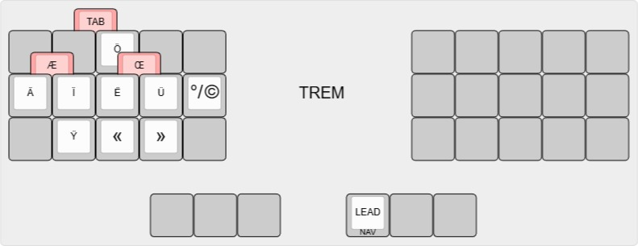
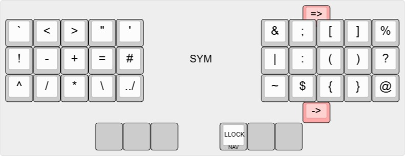

# Padaf3t's Dasbob QMK Keymap

This repository contains a custom keymap for the Dasbob keyboard, built upon the QMK firmware. It offers personalized key layouts and functionalities tailored to enhance typing efficiency and comfort.

## Keymap Overview

The keymap is structured to provide intuitive access to various functions through a combination of base and function layers. Each layer is designed with specific purposes in mind, ensuring a seamless typing experience.

> For a comprehensive understanding of keymap structures and layer configurations, refer to the [QMK Keymap Overview](https://docs.qmk.fm/keymap).

## Layers and Layout

The keyboard layout utilize Canadian multilingual standard which make it more easy typing (or doing macro) for accented character present in French

The keymap utilizes multiple layers to organize key functions efficiently. Each layer serves a distinct purpose, allowing for a versatile and customizable typing experience.
Please note that the red key are for the combo

First is my alpha layer(BASE) which is in a modified optimot layout [OPTIMOT](https://optimot.fr). A layout optimise for French and English

Next is my two accented layer for circumflex and trema (they use the same letter position as the base layer)

Next my symbol layer which is taken from Getreuer

Now my number layer which use a style similar to dvorak layout, Even number on the left side and Odd number on the rigth. The space is put to make it more easy to space the number

Here is my function layer, similar to the number layer for the position, I add some function like ctrl-alt-delete and open task manager to have a more easy way to type them

The next two layer are for the navigation on the screen and in windows

## Adding This Keymap to Your QMK Setup

To incorporate this custom keymap into your QMK firmware setup, follow these steps:

1. **FORK the QMK Firmware Repository to your github repo**  
   If you haven't already, fork the [QMK Firmware repository](https://github.com/qmk/qmk_firmware) to your local machine.

2. **Navigate to the Keyboards Directory**  
   Place the `dasbob` folder within the `qmk_firmware/keyboards/` directory.

3. **Follow the qmk docs to compile and flash your Firmware**  
For detailed instructions on adding custom keymaps, refer to the [QMK Keymap Documentation](https://docs.qmk.fm/keymap).

## References

- [QMK Firmware](https://github.com/qmk/qmk_firmware)
- [QMK Keymap Documentation](https://docs.qmk.fm/keymap)
- [QMK Documentation Templates](https://docs.qmk.fm/documentation_templates)
- [QMK Keyboard Guidelines](https://docs.qmk.fm/hardware_keyboard_guidelines)
- [Designing a symbol layer](https://getreuer.info/posts/keyboards/symbol-layer/index.html))
